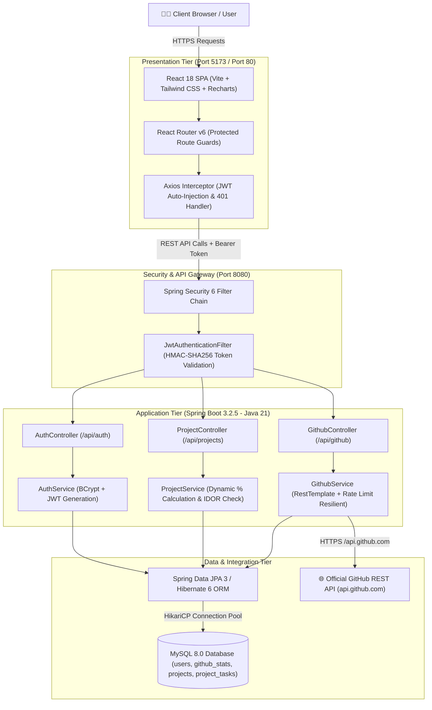
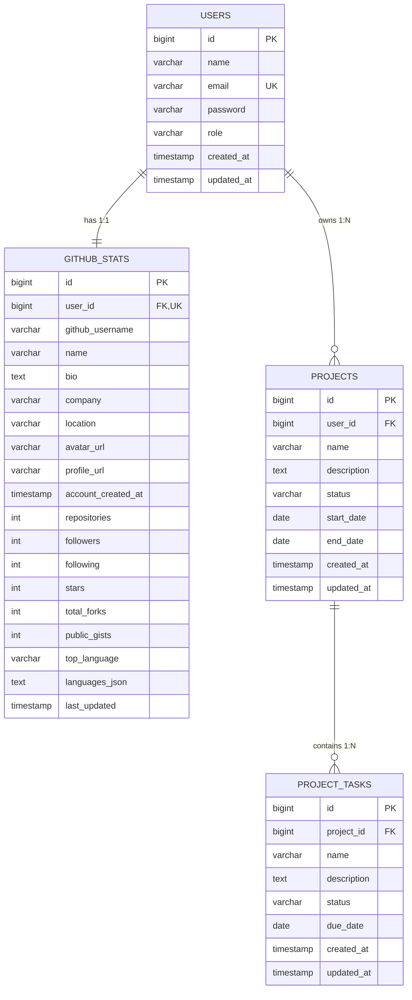

# DevTrack - System Architecture & Technical Specifications

---

## 1. Architectural Overview

DevTrack is built following a clean, decoupled **Client-Server Architecture** adhering to enterprise domain-driven design, stateless session management, and strict relational normalization (3NF).

---

## 2. Core Architectural Pillars

### A. Presentation Tier (React 18 + Vite)
- **Component Hierarchy**: Modular UI with reusable atomic components (`Card`, `StatCard`, `Badge`, `EmptyState`, `LoadingSpinner`).
- **State Management**: Centralized `AuthContext` provides authenticated user context, persistent tokens, and proactive session clearing.
- **Route Protection**: `ProtectedRoute` wrapper enforces authentication boundaries prior to component rendering.
- **Data Visualizations**: Recharts declarative charts render real-time language distributions and project status breakdowns.

### B. Security & API Tier (Spring Security 6 + JJWT)
- **Stateless Authentication**: Completely session-free. Every authorized request requires an HMAC-SHA256 signed JWT Bearer token in the `Authorization` header.
- **Cryptographic Hashing**: User credentials hashed with BCrypt (10 rounds of salt) prior to database persistence.
- **CORS Whitelisting**: Strict origin controls prevent unauthorized cross-origin invocations.
- **OpenAPI 3.0 Documentation**: Interactive Swagger interface at `/swagger-ui/index.html`.

### C. Domain & Business Logic Tier
- **Data Isolation & IDOR Protection**: All mutations on projects and tasks verify that the entity's `user_id` matches the authenticated `UserPrincipal` extracted from the JWT token.
- **Dynamic Progress Engine**: Project completion percentages are dynamically computed:
  $$\text{Completion \%} = \left( \frac{\sum \text{Status} = \text{COMPLETED}}{\text{Total Tasks}} \right) \times 100$$
- **Automatic Status Synchronization**: When all tasks under a project reach `COMPLETED`, the project status automatically updates to `COMPLETED`.

### D. External Integration Tier (GitHub REST API)
- **Live Synchronization**: Queries `https://api.github.com/users/{username}` and `https://api.github.com/users/{username}/repos` with pagination up to 300 repositories.
- **Mathematical Accuracy**: Groups and ranks dominant codebase languages, sums total stargazers, and counts repository forks.
- **Rate Limit Resilience**: Catches HTTP 429 / 403 responses and serves cached snapshots from MySQL without crashing the user interface.

---

## 3. Relational Database Schema (3NF)

